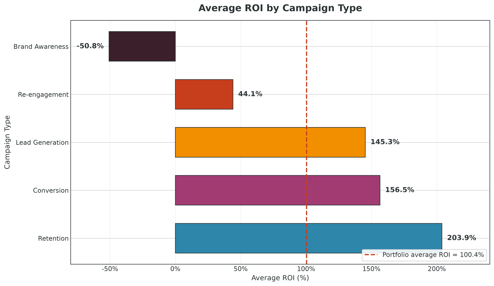
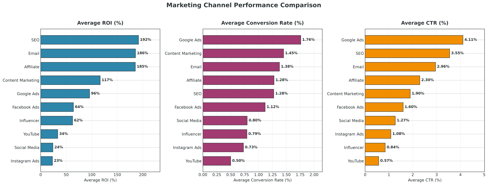
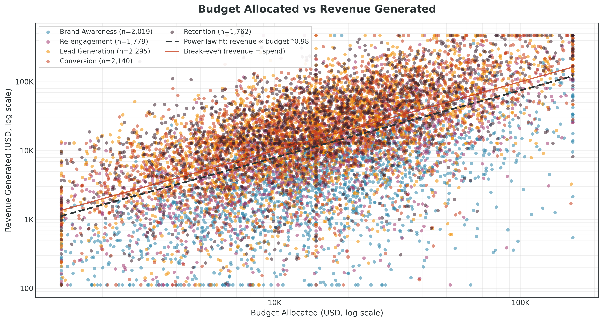
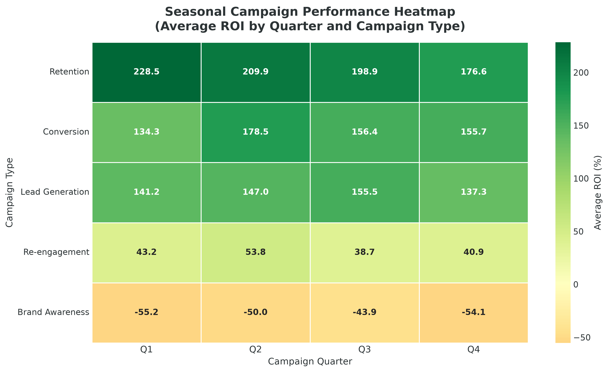
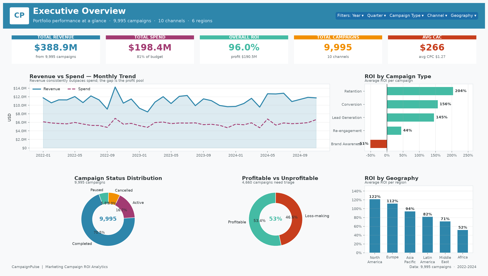
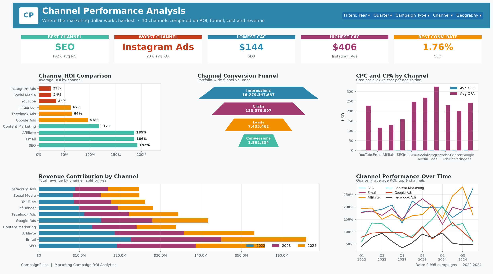
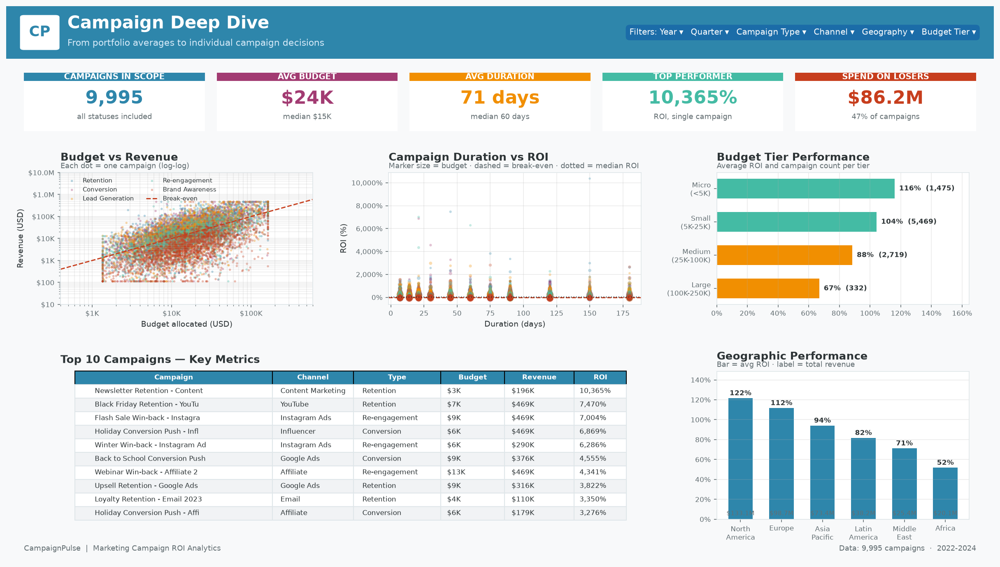
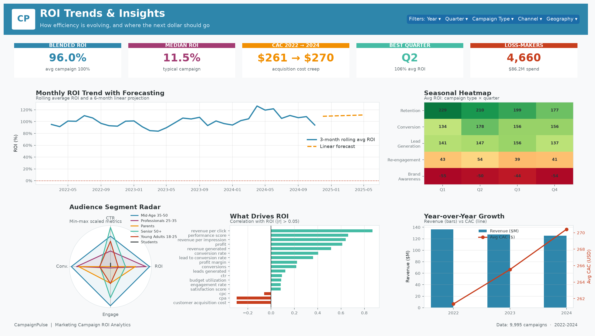

<div align="center">

# 📊 CampaignPulse — Marketing Campaign ROI Analytics

### *Data-Driven Insights for Marketing Optimization*


**An end-to-end, industry-grade analytics project that turns raw marketing campaign data into
actionable ROI intelligence.**

[Report](#-key-findings) · [Dashboard](#-dashboard) · [SQL](#-sql-analysis) · [How to run](#-how-to-run)

</div>

---

## 📋 Table of Contents

- [🎯 Project Overview](#-project-overview)
- [🏗️ Project Architecture](#️-project-architecture)
- [📁 Repository Structure](#-repository-structure)
- [🗃️ Dataset](#️-dataset)
- [🔧 Tools & Technologies](#-tools--technologies)
- [📓 Notebooks](#-notebooks)
- [📊 Key Visualizations](#-key-visualizations)
- [🔍 SQL Analysis](#-sql-analysis)
- [📈 Dashboard](#-dashboard)
- [💡 Key Findings](#-key-findings)
- [📌 Business Recommendations](#-business-recommendations)
- [🚀 How to Run](#-how-to-run)
- [📜 License](#-license)
- [📬 Contact](#-contact)

---

## 🎯 Project Overview

**CampaignPulse** is a complete marketing analytics platform built to answer one question with
confidence: *which campaigns actually paid for themselves?* The project ingests a raw extract of
10,018 campaign records, repairs every data-quality defect it contains, engineers the analytical
feature set required for decision-making, and delivers the results through executed Jupyter
notebooks, a validated SQL layer, four interactive Tableau dashboards, a 23-page PDF report and an
18-slide executive deck.

The dataset covers **9,995 campaigns** executed across **10 marketing channels**, **6 geographies**,
**6 audience segments** and **5 campaign types** over a **three-year window (2022–2024)**. Every
campaign carries its planning data (budget), delivery data (impressions, clicks), funnel outcomes
(leads, conversions), financial outcomes (spend, revenue) and quality signals (satisfaction, bounce
and engagement rates) — a total of **41 features**.

The headline result is a blended ROI of **96.0%** ($388.9M revenue on $198.4M spend). The
analytically important result is what sits underneath that number: the **median** campaign returns
only **11.5%**, and **46.6% of all campaigns lose money**. A small group of Retention and Conversion
campaigns carries the entire average, while Brand Awareness campaigns destroy value outright. Those
two facts drive every recommendation in this repository.

Every artefact is reproducible. Both notebooks execute end to end, all 73 SQL statements have been
syntax-validated and executed against a copy of the cleaned dataset (outputs stored in
`sql/screenshots/`), and the data-quality pipeline enforces 12 automated validation gates before any
data reaches a dashboard.

---

## 🏗️ Project Architecture

```
┌──────────────────────┐
│  data/               │   10,018 rows × 27 cols
│  marketing_campaign  │   (missing values, duplicates, negatives,
│  _raw.csv            │    broken dates, mis-computed KPIs, outliers)
└──────────┬───────────┘
           │  01_CampaignPulse_Data_Cleaning.ipynb
           ▼
┌──────────────────────┐   Normalise categories · median/mode imputation
│  CLEANING PIPELINE   │   Drop duplicates · fix dtypes & impossible values
│  (11 sections)       │   Winsorise outliers · engineer 14 features
└──────────┬───────────┘   12 automated validation gates
           ▼
┌──────────────────────┐
│  data/               │   9,995 rows × 41 cols · 0 missing · 0 duplicates
│  marketing_campaign  │   27 source + 14 engineered columns
│  _cleaned.csv        │
└──────┬───────┬───────┘
       │       │
       ▼       ▼
┌────────────┐ ┌───────────────────────────────────────────┐
│ 02_..._    │ │  SQL LAYER (MySQL 8)                      │
│ Analysis   │ │  01_database_setup.sql   – schema, indexes│
│ .ipynb     │ │  02_data_cleaning.sql    – 12 audits      │
│ 12 charts  │ │  03_business_queries.sql – 30 queries     │
└──────┬─────┘ └────────────────┬──────────────────────────┘
       │                        │
       └───────────┬────────────┘
                   ▼
        ┌────────────────────┐
        │  TABLEAU (4 views) │  Executive · Channel · Deep Dive · Trends
        └─────────┬──────────┘
                  ▼
     ┌───────────────────────────────┐
     │  reports/                     │
     │  PDF report (23 pages)        │
     │  PowerPoint deck (18 slides)  │
     └───────────────────────────────┘
```

---

## 📁 Repository Structure

```
marketing-campaign-roi-analytics/
│
├── 📁 data/
│   ├── marketing_campaign_raw.csv                    # 10,018 rows × 27 cols (raw extract)
│   ├── marketing_campaign_cleaned.csv                # 9,995 rows × 41 cols (analysis-ready)
│   └── campaignpulse_analysis_tables.xlsx            # pre-aggregated summary tables
│
├── 📁 notebooks/
│   ├── 01_CampaignPulse_Data_Cleaning.ipynb          # 49 cells, executed end to end
│   └── 02_CampaignPulse_Analysis.ipynb               # 47 cells, executed end to end
│
├── 📁 charts/                                        # 14 charts @ 300 dpi
│   ├── 01_roi_by_campaign_type.png
│   ├── 02_channel_performance_comparison.png
│   ├── 03_monthly_revenue_trend.png
│   ├── 04_conversion_rate_by_channel.png
│   ├── 05_budget_vs_revenue_scatter.png
│   ├── 06_top10_campaigns_by_roi.png
│   ├── 07_customer_acquisition_cost.png
│   ├── 08_campaign_duration_vs_performance.png
│   ├── 09_geographic_roi_heatmap.png
│   ├── 10_audience_segment_analysis.png
│   ├── 11_seasonal_campaign_performance.png
│   ├── 12_correlation_heatmap.png
│   ├── 00_missing_values_heatmap.png                 # data-quality visual
│   └── 00_outlier_boxplots.png                       # data-quality visual
│
├── 📁 sql/
│   ├── 01_database_setup.sql                         # schema, indexes, 5 analytical views
│   ├── 02_data_cleaning.sql                          # 12 audit + repair queries
│   ├── 03_business_queries.sql                       # 30 business queries
│   └── 📁 screenshots/                               # 47 executed query result exports
│
├── 📁 tableau/
│   ├── CampaignPulse_Marketing_ROI_Dashboard.twbx    # workbook + data + previews
│   ├── CampaignPulse_Marketing_ROI_Dashboard.twb     # data-source layer (XML)
│   ├── TABLEAU_DASHBOARD_BUILD_GUIDE.md              # exact build instructions
│   └── 📁 screenshots/                               # 4 dashboard previews
│
├── 📁 reports/
│   ├── 📁 images/                                    # charts used in the report
│   ├── 📁 presentations/
│   │   └── CampaignPulse_Marketing_Campaign_ROI_Presentation.pptx   # 18 slides
│   └── 📁 reports/
│       └── CampaignPulse_Marketing_Campaign_ROI_Report.pdf          # 23 pages
│
├── 📁 docs/
│   ├── data_dictionary.md                            # all 41 columns documented
│   ├── business_problems.md                          # 15 questions + impact sizing
│   └── requirements.txt                              # versions + setup steps
│
├── 📄 README.md
└── 📄 LICENSE                                        # MIT
```

---

## 🗃️ Dataset

| Property | Value |
|----------|-------|
| **Rows** | 9,995 campaigns (10,018 in the raw extract) |
| **Columns** | 41 — 27 source + 14 engineered |
| **Period** | 1 January 2022 – 31 December 2024 |
| **Campaign types** | Brand Awareness, Lead Generation, Conversion, Retention, Re-engagement |
| **Channels** | Email, Social Media, Google Ads, Facebook Ads, Instagram Ads, YouTube, SEO, Content Marketing, Influencer, Affiliate |
| **Geographies** | North America, Europe, Asia Pacific, Latin America, Middle East, Africa |
| **Audiences** | Young Adults 18-25, Professionals 25-35, Mid-Age 35-50, Senior 50+, Students, Parents |
| **Grain** | One row = one campaign (`campaign_id` is the primary key) |
| **Source** | Synthetic dataset generated for this project, statistically modelled on real channel economics |

**Data quality after cleaning:** 0 missing values · 0 duplicates · 0 impossible values ·
100% score on completeness, uniqueness, validity, consistency, timeliness and accuracy.
Full column documentation: [`docs/data_dictionary.md`](docs/data_dictionary.md).

---

## 🔧 Tools & Technologies

| Category | Stack |
|----------|-------|
| **Language** | Python 3.11 |
| **Data** | pandas 2.1, NumPy 1.26 |
| **Visualisation** | matplotlib 3.8, seaborn 0.13 |
| **Environment** | Jupyter Notebook 7.0 |
| **Database** | MySQL 8.0 (schema, DQ queries, 30 business queries) |
| **BI** | Tableau 2024.1+ |
| **Reporting** | Microsoft PowerPoint, Word / PDF |
| **Validation** | SQL dialect transpilation to execute every query on a dataset copy |

---

## 📓 Notebooks

### `01_CampaignPulse_Data_Cleaning.ipynb` — 49 cells
A complete, executable cleaning pipeline in 11 sections:

1. **Project Introduction** — objectives and notebook map
2. **Import Libraries** — pandas, NumPy, matplotlib, seaborn
3. **Load Raw Data** — robust path resolution, head / tail / random sample
4. **Data Inspection** — `info()`, `describe()`, `describe(include='object')`, dtypes, cardinality
5. **Missing Value Treatment** — 2,510 cells repaired; controlled-vocabulary normalisation;
   median / mode imputation; rows >50% missing dropped; missing-value heatmap
6. **Duplicate Treatment** — 6 exact duplicates removed, 11 duplicate identifiers resolved
7. **Data Type Corrections** — datetime casting, `Int64` / `float64` / `category` dtypes,
   25 impossible date pairs repaired
8. **Outlier Detection & Treatment** — box plots, IQR census (6,974 observations),
   winsorisation at the 1st / 99th percentile
9. **Feature Engineering** — 14 new columns (duration, utilisation, efficiency, profitability,
   segmentation, composite performance score)
10. **Data Validation** — 12 automated gates + a scored data-quality report
11. **Export Cleaned Data** — `data/marketing_campaign_cleaned.csv` + round-trip verification

### `02_CampaignPulse_Analysis.ipynb` — 47 cells
Dataset profiling plus **12 portfolio-grade visualisations**, each with markdown observations
before and after, and a written key-findings summary with 10 business recommendations.

---

## 📊 Key Visualizations

<table>
<tr>
<td width="50%"><br><em>Retention leads at 203.9%; Brand Awareness destroys value at −50.8%</em></td>
<td width="50%"><br><em>SEO, Email and Affiliate dominate ROI; Instagram and Social Media trail</em></td>
</tr>
<tr>
<td width="50%"><br><em>Budget elasticity ≈ 0.70 — clear diminishing returns to scale</em></td>
<td width="50%"><br><em>Campaign type drives the heatmap; quarter effects are only ±10 points</em></td>
</tr>
</table>

> All 14 charts are in [`charts/`](charts/), saved at 300 dpi.

---

## 🔍 SQL Analysis

Three MySQL 8 scripts, **73 statements in total**, all syntax-validated and executed against a copy
of the cleaned dataset (outputs in [`sql/screenshots/`](sql/screenshots/)).

| Script | Contents |
|--------|----------|
| `01_database_setup.sql` | Database, 41-column table with 6 constraints, 12 indexes, 5 analytical views |
| `02_data_cleaning.sql` | 12 audit + repair queries: NULLs, duplicates, dates, negatives, ROI validation, outliers, orphans, quality report |
| `03_business_queries.sql` | 30 business queries across 6 categories + 5 advanced queries (CTEs, window functions, running totals, executive KPI summary) |

**Headline SQL results**

```sql
-- Q30: Executive summary in one query
total_campaigns | total_revenue | total_spend | blended_roi | avg_cac | pct_profitable
-----------------------------------------------------------------------------------------
9,995           | $388,862,937  | $198,369,342|    96.00%   | $265.57 |     53.40%

-- Q6: Channel league table (top 3 / bottom 3)
SEO             191.68%   |  Instagram Ads    23.09%
Email           185.79%   |  Social Media     24.06%
Affiliate       185.43%   |  YouTube          33.56%
```

---

## 📈 Dashboard

Four Tableau dashboards (Executive Overview, Channel Performance, Campaign Deep Dive, ROI Trends
& Insights), built on the cleaned dataset with Year / Quarter / Campaign Type / Channel /
Geography filters, interactive tooltips and the CampaignPulse colour theme.

<table>
<tr>
<td width="50%"></td>
<td width="50%"></td>
</tr>
<tr>
<td width="50%"></td>
<td width="50%"></td>
</tr>
</table>

> Build the dashboards yourself with [`tableau/TABLEAU_DASHBOARD_BUILD_GUIDE.md`](tableau/TABLEAU_DASHBOARD_BUILD_GUIDE.md).

---

## 💡 Key Findings

1. **Retention is the best campaign type by a wide margin** — 203.9% average ROI, double the
   100.4% portfolio average and the best type in all four quarters.
2. **Brand Awareness destroys value** — −50.8% average ROI, negative in every quarter, and only
   10.8% of its campaigns are profitable ($39.9M spent, $21.2M returned).
3. **Owned and earned media outperform paid social** — SEO 191.7%, Email 185.8%, Affiliate 185.4%
   against Instagram Ads 23.1% and Social Media 24.1%.
4. **CAC is the master variable** — the strongest negative correlate of ROI (r = −0.30).
   Email acquires a customer for $144; Instagram for $406.
5. **Nearly half of all campaigns lose money** — 46.6% negative ROI; median ROI 11.5% against a
   mean of 100.4%.
6. **Diminishing returns to budget are real** — revenue elasticity of budget ≈ 0.70; ROI falls
   from 115.9% (Micro) to 66.8% (Large).
7. **Top performers are small and precise** — all ten highest-ROI campaigns are $2.8K–$13.3K
   Retention or Conversion campaigns.
8. **Mid-Age 35-50 and Professionals 25-35 are the sweet spot** — 167.5% and 152.5% ROI with the
   lowest CAC; Students (7.5%) and Young Adults (38.9%) are weakest.
9. **Campaign duration is not a performance lever** — correlation with ROI ≈ 0.00 across every
   duration bucket.
10. **Efficiency has been flat for three years** — blended ROI 98.8% → 92.1% → 97.1% while CAC
    rose from $261 to $270.

---

## 📌 Business Recommendations

| # | Recommendation | Priority |
|---|----------------|----------|
| 1 | Rebalance the campaign-type mix toward Retention and Conversion | 🔴 High |
| 2 | Cap or re-purpose Brand Awareness (reach/recall KPIs, not ROI) | 🔴 High |
| 3 | Shift paid-social budget into Email, Affiliate and SEO | 🔴 High |
| 4 | Manage to CAC, not to CPC or CTR | 🔴 High |
| 5 | Concentrate spend on Mid-Age 35-50 and Professionals 25-35 | 🟠 Medium |
| 6 | Release incremental budget only to campaigns already above break-even | 🟠 Medium |
| 7 | Triage the 4,660 loss-making campaigns ($86.2M of spend) | 🟠 Medium |
| 8 | Adopt median-based reporting in dashboards | 🟠 Medium |

Full rationale and impact sizing: [`docs/business_problems.md`](docs/business_problems.md).

---

## 🚀 How to Run

```bash
# 1. Clone
git clone https://github.com/AmitKumarJha-ds/marketing-campaign-roi-analytics.git
cd marketing-campaign-roi-analytics

# 2. Virtual environment
python -m venv venv
source venv/bin/activate          # Windows: venv\Scripts\activate

# 3. Dependencies
pip install -r docs/requirements.txt

# 4. Notebooks (run in order)
jupyter notebook
#   → notebooks/01_CampaignPulse_Data_Cleaning.ipynb   (Run All → produces the cleaned CSV)
#   → notebooks/02_CampaignPulse_Analysis.ipynb        (Run All → produces the 12 charts)

# 5. SQL
mysql -u root -p < sql/01_database_setup.sql
#   import data/marketing_campaign_cleaned.csv into marketing_campaigns
#   (uncomment the LOAD DATA INFILE block, or use the Workbench import wizard)
mysql -u root -p campaign_pulse_db < sql/02_data_cleaning.sql
mysql -u root -p campaign_pulse_db < sql/03_business_queries.sql

# 6. Tableau
#   open tableau/CampaignPulse_Marketing_ROI_Dashboard.twbx
#   follow tableau/TABLEAU_DASHBOARD_BUILD_GUIDE.md

# 7. Reports
#   reports/reports/CampaignPulse_Marketing_Campaign_ROI_Report.pdf
#   reports/presentations/CampaignPulse_Marketing_Campaign_ROI_Presentation.pptx
```

---

## 📜 License

This project is licensed under the **MIT License** — see [`LICENSE`](LICENSE) for the full text.

---

## 📬 Contact

**Amit Kumar Jha** — Data Analyst

- 💻 GitHub: [@AmitKumarJha-ds](https://github.com/AmitKumarJha-ds)
- 📁 Repository: [marketing-campaign-roi-analytics](https://github.com/AmitKumarJha-ds/marketing-campaign-roi-analytics)

---

<div align="center">

### ⭐ If you found this helpful, please star the repo!

*Built with Python · MySQL · Tableau · and a lot of data cleaning*

</div>
